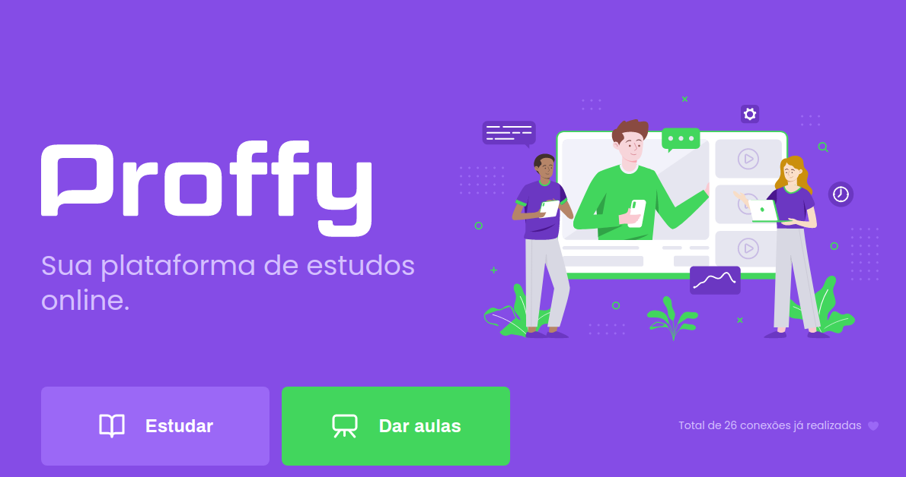
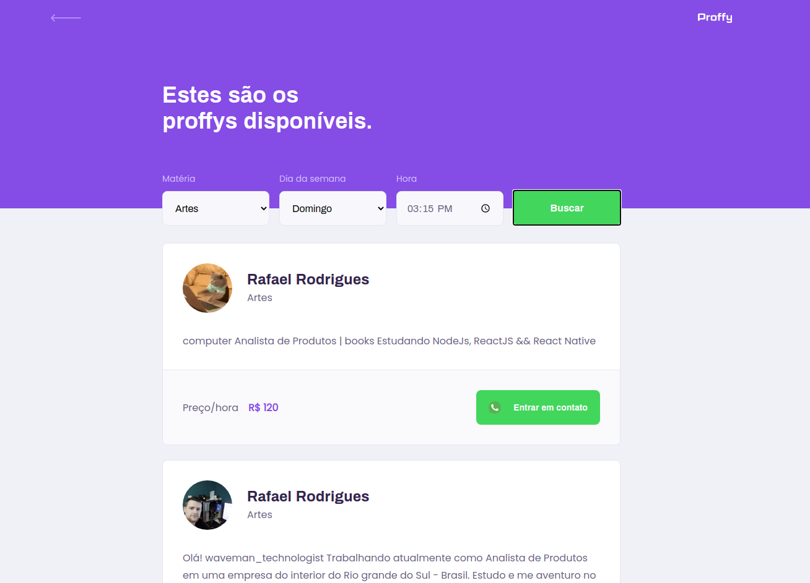

<h1 align="center">Proffy</h1>

Aplicativo <i>web</i> e <i>mobile</I> para conectar professores e estudantes.

<h4 align="center"> 
  :heavy_check_mark:  Proffy 🚀 Finalizado  :heavy_check_mark:
</h4>

    
  
  

 Sobre o projeto
=================

 Proffys é um aplicativo que busca conectar professores de diversas áreas e estudantes dos mais variados campos em uma só plataforma. Os estudantes podem procurar a aula do interesse e após, realizar o contato com o professor. 

<h2><a fallback-src="https://github.githubassets.com/images/icons/emoji/unicode/2699.png"></g-emoji> Funcionalidades</h2>

<ul>
  <li>
  
 Os professores podem se cadastrar informando:

    <ul class="contains-task-list">
      <li> Seu nome completo; </li>
      <li> Avatar para o perfil; </li>
      <li> Whatsapp;</li>
      <li> Quais aulas lesionam; </li>
      <li> Custo da aula por hora; </li>
      <li> Horários disponíveis. </li>
    </ul>
  </li>
</ul>

<ul>
  <li>Os alunos podem procurar os professores por filtro de nome da aula e horário "De" e "Até".</li>
</ul>

<ul>
<li> Os usuários tem acesso ao aplicativo móvel, onde podem:
  <ul>
    <li> Procurar professores para as aulas; </li>
    <li> Favoritar e "desfavoritar" professores. </li>
  </ul>
</li>
</ul>

 Demonstração da aplicação
=================
Mobile:

  

Web:

  

<h2><a fallback-src="https://github.githubassets.com/images/icons/emoji/unicode/1f680.png"></g-emoji> Como executar o projeto</h2>

Este projeto é divido em três partes:

<ol>
  <li>Backend (pasta server)</li>
  <li>Frontend (pasta web)</li>
  <li>Mobile (pasta mobile)</li>
</ol>

<g-emoji class="g-emoji" alias="bulb" fallback-src="https://github.githubassets.com/images/icons/emoji/unicode/1f4a1.png"></g-emoji>Tanto o Frontend quanto o Mobile precisam que o Backend esteja sendo executado para funcionar.

<h3><a></path></svg></a>Pré-requisitos</h3>

Antes de começar, você vai precisar ter instalado em sua máquina as seguintes ferramentas:
<a href="https://git-scm.com" rel="nofollow">Git</a>, <a href="https://nodejs.org/en/" rel="nofollow">Node.js</a>.
Além disto é bom ter um editor para trabalhar com o código como <a href="https://code.visualstudio.com/" rel="nofollow">VSCode</a>

<h4><a fallback-src="https://github.githubassets.com/images/icons/emoji/unicode/1f3b2.png"></g-emoji> Rodando o Backend (servidor)</h4>

<pre># Clone este repositório
$ git clone https://github.com/venuziano/Proffys

# Acesse a pasta do projeto no terminal/cmd
$ cd README.md

# Vá para a pasta server
$ cd server

# Instale as dependências
$ yarn install

# Execute a aplicação em modo de desenvolvimento
$ yarn start

# O servidor inciará na porta:3333 - acesse http://localhost:3333 
</pre>

<h4><a fallback-src="https://github.githubassets.com/images/icons/emoji/unicode/1f9ed.png"></g-emoji> Rodando a aplicação web (Frontend)</h4>

<pre># Clone este repositório
$ git clone https://github.com/venuziano/Proffys

# Acesse a pasta do projeto no seu terminal/cmd
$ cd README.md

# Vá para a pasta da aplicação Front End
$ cd web

# Instale as dependências
$ yarn install

# Execute a aplicação em modo de desenvolvimento
$ yarn start

# A aplicação será aberta na porta:3000 - acesse http://localhost:3000
</pre>

<h2><g-emoji class="g-emoji" alias="hammer_and_wrench" fallback-src="https://github.githubassets.com/images/icons/emoji/unicode/1f6e0.png">🛠</g-emoji> Tecnologias </h2>

<h4><strong>Server</strong> (<a href="https://nodejs.org/en/" rel="nofollow">NodeJS</a> + <a href="https://www.typescriptlang.org/" rel="nofollow">TypeScript</a>)</h4>

<ul>
  <li><strong><a href="https://expressjs.com/" rel="nofollow">Express</a></strong></li>
  <li><strong><a href="https://expressjs.com/en/resources/middleware/cors.html" rel="nofollow">CORS</a></strong></li>
  <li><strong><a href="http://knexjs.org/" rel="nofollow">KnexJS</a></strong></li>
  <li><strong><a href="https://github.com/mapbox/node-sqlite3">SQLite</a></strong></li>
  <li><strong><a href="https://github.com/TypeStrong/ts-node">ts-node</a></strong></li>
</ul>

<h4><strong>Website</strong> (<a href="https://reactjs.org/" rel="nofollow">React</a> + <a href="https://www.typescriptlang.org/" rel="nofollow">TypeScript</a>)</h4>

<ul>
  <li><strong><a href="https://github.com/ReactTraining/react-router/tree/master/packages/react-router-dom">React Router Dom</a></strong></li>
  <li><strong><a href="https://github.com/axios/axios">Axios</a></strong></li>
</ul>

<h4><strong>Mobile</strong> (<a href="http://www.reactnative.com/" rel="nofollow">React Native</a> + <a href="https://www.typescriptlang.org/" rel="nofollow">TypeScript</a>)</h4>

<ul>
  <li><strong><a href="https://expo.io/" rel="nofollow">Expo</a></strong></li>
  <li><strong><a href="https://github.com/expo/google-fonts">Expo Google Fonts</a></strong></li>
  <li><strong><a href="https://reactnavigation.org/" rel="nofollow">React Navigation</a></strong></li>
  <li><strong><a href="https://github.com/axios/axios">Axios</a></strong></li>
  <li><strong><a href="https://github.com/react-native-community/async-storage" rel="nofollow">AsyncStorage</a></strong></li>
  <li><strong><a href="https://github.com/software-mansion/react-native-reanimated" rel="nofollow">React Native Reanimated</a></strong></li>
</ul>

<h2><a fallback-src="https://github.githubassets.com/images/icons/emoji/unicode/1f9b8.png"></g-emoji> Autor</h2>

<b>Rafael Rodrigues</b>

 

<h2><a fallback-src="https://github.githubassets.com/images/icons/emoji/unicode/1f4dd.png"></g-emoji> Licença</h2>

Este projeto está sobe a licença <a href="https://github.com/venuziano/Proffys/blob/master/LICENSE">MIT</a>.

