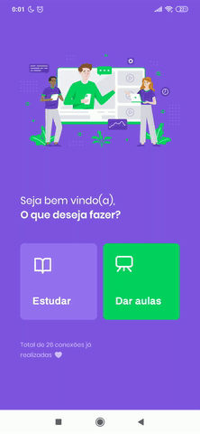

<h1 align="center">Proffy</h1>

<i>Web</i> and <i>mobile</I> application to connect teachers and students..

<h4 align="center"> 
  :heavy_check_mark:  Proffy 🚀 Finished  :heavy_check_mark:
</h4>

    
  
  

 About the project
=================

 Proffys is an application that seeks to connect teachers from different areas and students from the most varied fields on a single platform. Students can search for the class of interest and then contact the teacher. 

<h2><a fallback-src="https://github.githubassets.com/images/icons/emoji/unicode/2699.png"></g-emoji> Functionalities</h2>

<ul>
  <li>
  
 Teachers can register by informing:

    <ul class="contains-task-list">
      <li> Full name; </li>
      <li> Profile avatar; </li>
      <li> Whatsapp;</li>
      <li> Which classes hurt; </li>
      <li> Class cost per hour; </li>
      <li> Available times. </li>
    </ul>
  </li>
</ul>

<ul>
  <li> Students can search for teachers by class name and time filter "From" and "To".</li>
</ul>

<ul>
<li> Users have access to the mobile application, where they can:
  <ul>
    <li> Find teachers for classes; </li>
    <li> Favorite and "unfavorite" teachers. </li>
  </ul>
</li>
</ul>

 App demonstration
=================
Mobile:

  

Web:

  

<h2><a fallback-src="https://github.githubassets.com/images/icons/emoji/unicode/1f680.png"></g-emoji> How to execute the project </h2>

 This project is splitted into three steps: 

<ol>
  <li>Backend (server folder)</li>
  <li>Frontend (web folder)</li>
  <li>Mobile (mobile folder)</li>
</ol>

<g-emoji class="g-emoji" alias="bulb" fallback-src="https://github.githubassets.com/images/icons/emoji/unicode/1f4a1.png"></g-emoji>The server side must be running to the frontend and the mobile side work without problem.

<h3><a></path></svg></a>Prerequirements</h3>

Before starting, you will need to have the following tools installed on your machine::
<a href="https://git-scm.com" rel="nofollow">Git</a>, <a href="https://nodejs.org/en/" rel="nofollow">Node.js</a>.
Besides, it's good to have an editor to work with the code like <a href="https://code.visualstudio.com/" rel="nofollow">VSCode</a>

<h4><a fallback-src="https://github.githubassets.com/images/icons/emoji/unicode/1f3b2.png"></g-emoji> Running the server side </h4>

<pre># Clone this repository
$ git clone https://github.com/venuziano/Proffys

# Access the project folder in the terminal/cmd
$ cd README.md

# Go to the server folder
$ cd server

# Install the dependencies
$ yarn install

# Run the application in development mode
$ yarn start

# The server will start on port:3333 - go to http://localhost:3333 
</pre>

<h4><a fallback-src="https://github.githubassets.com/images/icons/emoji/unicode/1f9ed.png"></g-emoji> Running the frontend</h4>

<pre># Clone this repository
$ git clone https://github.com/venuziano/Proffys

# Access the project folder in the terminal/cmd
$ cd README.md

# Go to the web folder
$ cd web

# Install the dependencies
$ yarn install

# Run the application in development mode
$ yarn start

# The server will start on port:3000 - go to http://localhost:3000
</pre>

<h2><g-emoji class="g-emoji" alias="hammer_and_wrench" fallback-src="https://github.githubassets.com/images/icons/emoji/unicode/1f6e0.png">🛠</g-emoji> Technologies </h2>

<h4><strong>Server</strong> (<a href="https://nodejs.org/en/" rel="nofollow">NodeJS</a> + <a href="https://www.typescriptlang.org/" rel="nofollow">TypeScript</a>)</h4>

<ul>
  <li><strong><a href="https://expressjs.com/" rel="nofollow">Express</a></strong></li>
  <li><strong><a href="https://expressjs.com/en/resources/middleware/cors.html" rel="nofollow">CORS</a></strong></li>
  <li><strong><a href="http://knexjs.org/" rel="nofollow">KnexJS</a></strong></li>
  <li><strong><a href="https://github.com/mapbox/node-sqlite3">SQLite</a></strong></li>
  <li><strong><a href="https://github.com/TypeStrong/ts-node">ts-node</a></strong></li>
</ul>

<h4><strong>Website</strong> (<a href="https://reactjs.org/" rel="nofollow">React</a> + <a href="https://www.typescriptlang.org/" rel="nofollow">TypeScript</a>)</h4>

<ul>
  <li><strong><a href="https://github.com/ReactTraining/react-router/tree/master/packages/react-router-dom">React Router Dom</a></strong></li>
  <li><strong><a href="https://github.com/axios/axios">Axios</a></strong></li>
</ul>

<h4><strong>Mobile</strong> (<a href="http://www.reactnative.com/" rel="nofollow">React Native</a> + <a href="https://www.typescriptlang.org/" rel="nofollow">TypeScript</a>)</h4>

<ul>
  <li><strong><a href="https://expo.io/" rel="nofollow">Expo</a></strong></li>
  <li><strong><a href="https://github.com/expo/google-fonts">Expo Google Fonts</a></strong></li>
  <li><strong><a href="https://reactnavigation.org/" rel="nofollow">React Navigation</a></strong></li>
  <li><strong><a href="https://github.com/axios/axios">Axios</a></strong></li>
  <li><strong><a href="https://github.com/react-native-community/async-storage" rel="nofollow">AsyncStorage</a></strong></li>
  <li><strong><a href="https://github.com/software-mansion/react-native-reanimated" rel="nofollow">React Native Reanimated</a></strong></li>
</ul>

<h2><a fallback-src="https://github.githubassets.com/images/icons/emoji/unicode/1f9b8.png"></g-emoji> Author</h2>

<b>Rafael Rodrigues</b>

 

<h2><a fallback-src="https://github.githubassets.com/images/icons/emoji/unicode/1f4dd.png"></g-emoji> License</h2>

This project is under license <a href="https://github.com/venuziano/Proffys/blob/master/LICENSE">MIT</a>.

